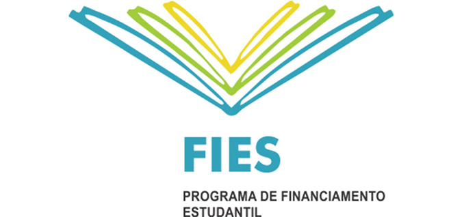
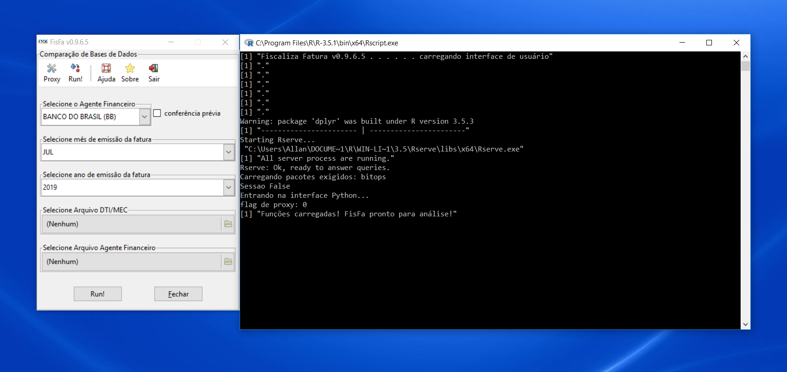
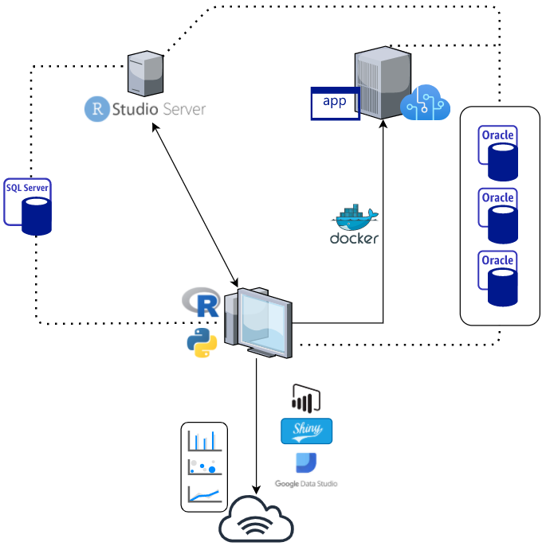
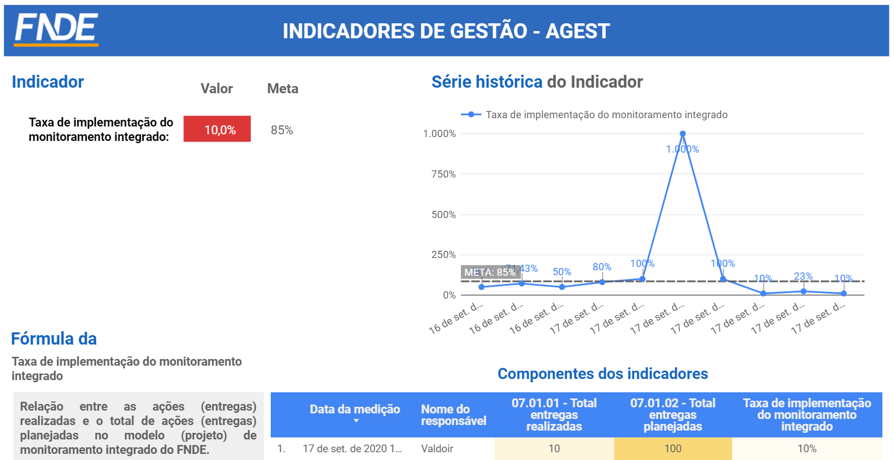
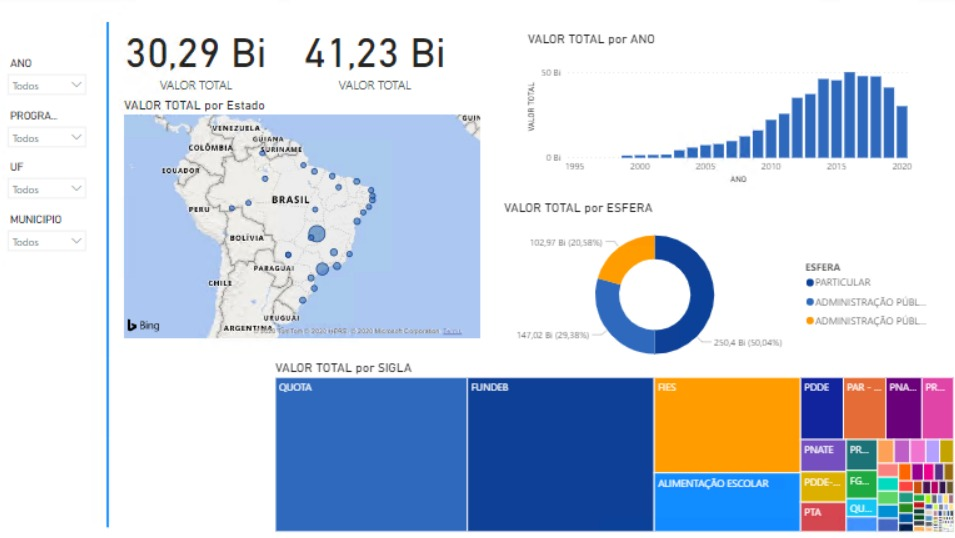
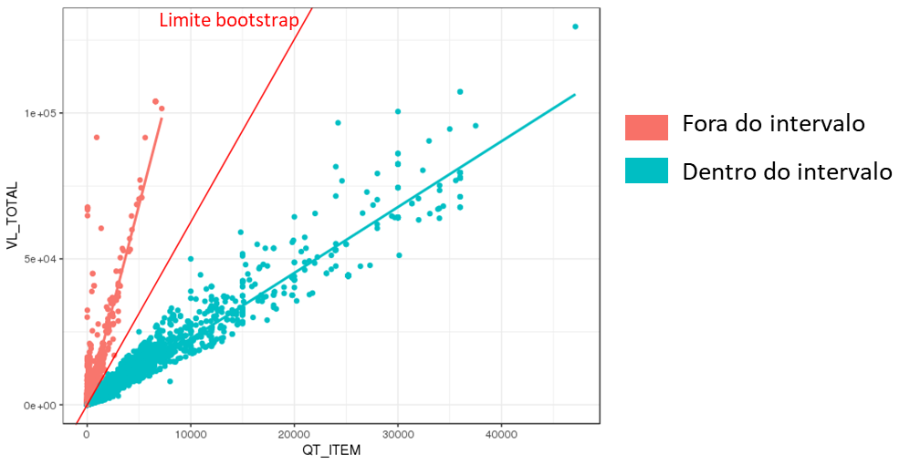
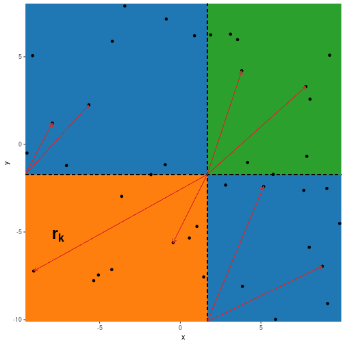

```{r setup, include=FALSE}
options(htmltools.dir.version = FALSE)
```

layout: true
background-image: url(./img/logo/fnde_blue.jpg)
background-position: 0% 100%
background-size: 5%

---

background-image: url(./img/dollar1.jpg)
background-size: 80%
background-position: 50% 50%


---

class: inverse, center, middle
<!-- title-slide-section-grey,  -->

## "In God we trust. All other must bring data."
<p style="text-align:right">W. Edwards Deming</p>

---

class: inverse, center, middle
## <font color =#76DFEC>Nosso </font><font color =#C2DB70>objetivo...</font>

</br>
</br>


---

class: inverse, center, middle
<!-- title-slide-section-grey,  -->

# <font color =#76DFEC>o <font><font color =#F8A53A>FNDE<font>


---

class: inverse, center, middle
<!-- title-slide-section-grey,  -->

# <code><font color =#C2DB70>$$$</font></code>

```{r, echo=FALSE, warning=FALSE, cache=FALSE, results='asis'}
cat('<iframe src="./img/plotly_orcamento.html" width="90%" height="50%" scrolling="no" seamless="seamless" frameBorder="1"> </iframe>')
```

---

## <font color =#C2DB70>Programas<font>
</br>
</br>
</br>


  



---

class: inverse, center, middle
<!-- title-slide-section-grey,  -->

## <code><font color =#76DFEC>Como </font><font color =#C2DB70>o </font><font color =#F8A53A>FNDE </font><font color =#C2DB70>lida(va) com esse imenso volume de dados</font><font color =#4C5455>?</font></code>


---

class: inverse, center, middle


---


---

</br>
</br>
</br>


---

</br>


---

class: center, middle
# <font color =#F8A53A>Resumo do problema</font>

.pull-left[

<code>

- imensa quantidade de dados

- dados extremamente sensíveis (financeiros, estratégicos)

</code>

]

--

.pull-right[

<code>
**análise de dados pouco profissional:**

  > projeções equivocadas;
  
  > indicadores inócuos/imprecisos;
  
  > controles falhos;
  
  > retrabalho;
  
  > desperdício de tempo;
  
  > desperdício de <font color =#C2DB70>$$$$</font>

</code>

]


---

class: center, middle
<!-- # <font color =#F8A53A>O projeto pioneiro...</font> -->
# <code><font color =#76DFEC>O projeto </font><font color =#F35A94>pioneiro</font></code>

---

class: center, middle

# <font color =#F8A53A>FisFa - Fiscaliza Fatura</font>
### **Aplicativo para fiscalização das faturas dos Agentes Financeiros do FIES**  


---

class: inverse, center, middle




---

<code> 
## **Resultados FisFa:**

.pull-left[

**tempo de análise de uma fatura:**

- passou de uma semana para < 1 minuto

**maior confiabilidade e robustez na análise**

**economia direta:**

- acima de R$200 milhões até 2018 💰

- diversos contratos em situação irregular

**economia indireta:**

- sem contratação de empresa de TI 💰

- hora/trabalho de servidores 💰

- identificação de erros na própria base do FNDE/MEC

]


.pull-right[

**Prêmios:**


]


---

class: inverse, center, middle
<!-- title-slide-section-grey,  -->

# <code><font color =#4C5455>Como estamos </font><font color =#F8A53A>hoje</font><font color =#4C5455>?</font></code>


---

class: inverse, center, middle
<!-- title-slide-section-grey,  -->

# <code><font color =#4C5455>O </font><font color =#F8A53A>Núcleo de Métodos Quantitativos </font><font color =#76DFEC>(QUANT)</font></code>

---

class: center, middle


Assessoria técnica vinculada 

à 

Assessoria de Gestão Estratégica e Governança

Presidência


---

class: center, middle
# <code><font color =#4C5455>Estrutura</font>

.pull-left[

<code>

**Pessoal:**

  > 5 pessoas (3 estatísticos, 1 engenheiro de produção, 1 cientista da computação);

  > 2 servidores e 3 consultores

</code>

]

--

.pull-right[

<code>

__Hardware/Software:__

<!--  -->
```{r, out.width = "400px", echo=FALSE}

```
</code>

]

---

class: inverse, center, middle


## <code><font color =#76DFEC>Projetos em </font><font color =#F35A94>andamento...</font></code>


---

# <code><font color =#C2DB70>Malha-Fina FNDE</font></code>
### **Análise de prestações de contas por meio de mineração de dados**  

.pull-left[
<code> 
### **Contextualização:**

**obrigação de prestar contas:**

- toda descentralização gera uma obrigação de prestar contas por parte do ente/entidade

- a obrigação do FNDE é analisar **TODAS**


</code>

]


.pull-right[
<code> 

**Números anuais:**  

- entrada: ~ 35.000 processos

- capacidade de análise*: ~ 3.500

- passivo: 290 mil prestações de contas

- $$$$: ~ R$90 bilhoes

**Problemas:**

- gestores terminam mandatos sem contas analisadas

- eventuais danos ao erário são identificados tardiamente 💸

</code>
]


---

# <code><font color =#C2DB70>Malha-Fina FNDE</font></code>

.pull-left[
<code>
**Solução:**

- aprendizagem de máquina supervisionada - classificação

- retorna uma probabilidade (nota de risco) de dano ao erário

</code>

]

--

.pull-right[

<code>

**Resultados:**

- eliminação do passivo em ~ 5 anos

- economia de mais de R$ 3 bilhoes 💰

- economia de mais de meio século de trabalho 💰

- redução do ímpeto de fraude 

</code>

]


---

class: center, middle
# <code><font color =#F8A53A>Estimativa da quantidade de livros a serem comprados no <font color =#76DFEC>PNLD</font></font></code>


---

# <font color =#76DFEC>Programa Nacional do Livro Didático - PNLD</font>
### **Séries temporais para estimar o número de alunos para cada série em todas as escolas do Brasil**  

<code> 
### **Contextualização:**

.pull-left[
- Todo ano o FNDE realiza a compra centralizada e distribuição dos livros didáticos de todas as escolas públicas do país

- são 5.570 municípios, 27 estados

- as escolas tem liberdade para escolherem seu material didático

]

--

.pull-right[
**Problema:**

- Não se conhece o número de alunos do próximo ano

**Como fazíamos a estimativa:**
</code>

- $Q_{2020} = Q_{2019} + \delta x$, $\delta x = 🧙$

]


---

<code> 
## **Resultados Estimativa PNLD**

<br>

- Metodologia científica para gestão de riscos;


- Dados confiáveis - censo escolar;


- Possibilidade inclusive de estimar o erro;


- Indícios de melhora com relação ao método anterior


---

class: inverse, center, middle


## <code><font color =#F8A53A>Outras </font><font color =#76DFEC>iniciativas </font><font color =#C2DB70> e projetos</font></code>


---

<br>
<br>


.pull-left[

__Painel de Indicadores__


]

--

.pull-right[

__Painel de Gestão__



]


---

<br>
<br>

.pull-left[

__Metodologia para identificação de sobre-preço__



]


--

.pull-right[

__Metodologia para ranqueamento de municípios__

<!-- {width=150px} -->
```{r, out.width = "250px", echo=FALSE}

```


]

---

class: inverse, center, middle

## <code><font color =#76DFEC>Como </font><font color =#C2DB70>chegamos </font><font color =#F8A53A>até </font><font color =#C2DB70>aqui</font><font color =#4C5455>?</font></code>

---

class: center, middle
# <font color =#F8A53A>Reconhecer Limitações e Vantagens</font>

.pull-left[

<code>

**Vantagens:**

  > grande disponibilidade e variedade de dados;

  > facilidade para se capacitar (licenças, escolas de governo, MOOCS)

  >  áreas de T.I. não conseguem acompanhar a necessidade de informação das áreas de negócio

</code>

]

--

.pull-right[

<code>

**Limitações:**

  > restrições de <font color =#C2DB70>$$$$</font>;

  > restrições de pessoal (especializado);

  > LGPD;

  > burocracia;

  > __resistência à mudança__

</code>

]


---

class: inverse, center, middle
<!-- title-slide-section-grey,  -->

# <font color =#76DFEC>Como superar <font><font color =#F8A53A>a resistência à mudança<font color =#4C5455>?</font></code>

---

class: center, middle
# <font color =#F8A53A>Vencendo a resistência...</font>

.pull-left[

<code>

**"compre" seu patrocínio:**

  >  entregar primeiro, prometer depois

  > escolher quais "batalhas" lutar (regra de Pareto)

  > investir no bom relacionamento com: chefia, áreas de negócio, T.I.
  
  > se atenha à regra dos 5 dias

</code>

]

--

.pull-right[

<code>

__investir em capacitação:__ 

  > primar pelo conhecimento estatístico-matemático

  > se você sabe Python, aprenda R; se sabe R, aprenda Python

</code>

]


---

class: title-slide-final, middle
background-image: url()
background-size: 100px
background-position: 9% 15%

# Obrigado!!

</br>
</br>

## <code><font color =#F8A53A>Duvidas </font><font color =#76DFEC>ou </font><font color =#C2DB70>Perguntas?</font></code>


### .white[Contato:]

<p>
<a href="mailto:allan.quadros@fnde.gov.br"><i class="fa fa-paper-plane fa-fw"></i> allan.quadros@fnde.gov.br</a>
</p>


<!-- como colocar figuras ao lado de palavras varias vezes em html -->
<div>
    <p>Feito no
     com 
    .
    </p>
</div>

Apresentação disponível em:

<p>
<a href="https://allanvc.github.io/slide_SNCTNF2020/" style="color:navyblue">https://allanvc.github.io/slide_SNCTNF2020/</a>
</p>

<br>
